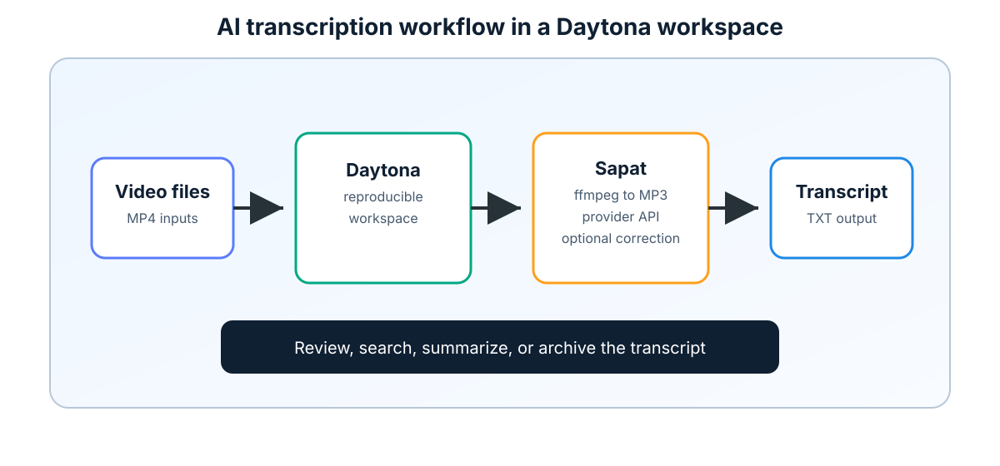

# Build an AI Transcription Pipeline with Daytona

# Introduction

Video is useful while people are watching it, but text is what makes the same
material searchable, reusable, and easy to review. Product demos, internal
walkthroughs, support calls, lectures, and research interviews all become easier
to work with once they have clean transcripts. The hard part is making the
workflow repeatable so that every developer on a team can run the same process
without rebuilding a local machine by hand.

This guide shows how to use [Daytona](https://www.daytona.io/) with
[Sapat](https://github.com/nkkko/sapat), a small Python command-line tool that
extracts audio with `ffmpeg` and sends it to OpenAI, Groq, or Azure OpenAI for
[speech-to-text transcription](../definitions/20260511_definition_speech_to_text_transcription.md).
By the end, you will have a reproducible workspace, a configured provider, a
working `sapat` command, and a checklist for validating transcript quality.

## TL;DR

- Create a Daytona workspace from the Sapat repository so the environment is
  isolated and repeatable.
- Install Sapat, `ffmpeg`, and provider credentials in that workspace.
- Run `sapat` against one video file or a directory of `.mp4` files.
- Use prompts, language hints, and optional correction to improve quality.
- Verify the generated `.txt` files before using them in downstream AI systems.

## Prerequisites

Before starting, make sure you have:

- A GitHub account and Daytona installed on your machine.
- An IDE such as VS Code.
- Python 3.6 or newer inside the workspace.
- `ffmpeg` available in the workspace terminal.
- An API key for one transcription provider: OpenAI, Groq, or Azure OpenAI.
- A short `.mp4` video you are allowed to process.

This guide uses Sapat directly from its public repository. If you plan to use
the pipeline for private meetings, customer calls, or sensitive recordings,
confirm that your chosen provider, retention settings, and internal data
policies allow those files to be processed.

## Step 1: Understand the Transcription Flow

Sapat keeps the workflow simple. You give it a video file or a folder of video
files. It converts each `.mp4` file into a temporary MP3 file with `ffmpeg`,
sends that audio to the selected provider, writes the transcript to a `.txt`
file next to the original video, and removes the temporary MP3 file.



That flow has four practical benefits:

- **Repeatability**: Daytona gives each run a consistent workspace instead of
  relying on whatever is installed on your laptop.
- **Provider choice**: Sapat supports `openai`, `groq`, and `azure` through the
  same command-line interface.
- **Batch processing**: A directory input lets you transcribe every `.mp4` file
  in that folder.
- **Simple output**: Each transcript is saved as plain text, which is easy to
  review, search, summarize, or commit to a documentation workflow.

The most important constraint is that Sapat currently expects the `--api`
option. The CLI will not choose a provider for you, so every run should include
one of `--api openai`, `--api groq`, or `--api azure`.

## Step 2: Create a Daytona Workspace

Start with a clean workspace from the Sapat repository:

```bash
daytona create https://github.com/nkkko/sapat --code
```

Daytona will clone the repository and open it in your selected IDE. If your
Daytona setup asks for a target, choose the target that matches where you want
the workspace to run. For local experimentation, a local target is enough. For
shared team usage, use the target your team already uses for Daytona projects.

Once the workspace opens, verify that you are in the repository root:

```bash
pwd
ls
```

You should see files such as `README.md`, `pyproject.toml`, and the `src`
directory. The `pyproject.toml` file defines the `sapat` console command, so
installing the package in editable mode is the easiest way to test the CLI while
still working from the source checkout.

## Step 3: Install Sapat and ffmpeg

Install the Python package from the repository root:

```bash
python -m pip install -e .
```

Then check whether `ffmpeg` is available:

```bash
ffmpeg -version
```

If the command is missing, install it inside the workspace. On Debian or Ubuntu
based images, use:

```bash
sudo apt-get update
sudo apt-get install -y ffmpeg
```

Now verify the Sapat command:

```bash
sapat --help
```

The help output should show options for `--language`, `--prompt`,
`--temperature`, `--quality`, `--correct`, and `--api`. The `--quality` option
controls the temporary MP3 settings before upload:

| Quality | Audio settings | Best use |
| --- | --- | --- |
| `L` | 22.05 kHz mono, 96 kbps | Small files or quick tests |
| `M` | 44.1 kHz mono, 96 kbps | Default general-purpose mode |
| `H` | 44.1 kHz stereo, 192 kbps | Higher quality source audio |

For most voice recordings, start with `M`. Use `H` when the source has multiple
speakers, background noise, or music that may affect recognition.

## Step 4: Configure a Provider

Sapat loads provider settings from a `.env` file in the repository root. Create
one with only the provider you plan to use. Keep this file out of source control
because it contains secrets.

For OpenAI:

```bash
OPENAI_API_KEY=your_openai_api_key
OPENAI_MODEL=whisper-1
OPENAI_API_ENDPOINT=https://api.openai.com/v1/audio/transcriptions
OPENAI_MODEL_NAME_CHAT=gpt-4o
```

For Groq:

```bash
GROQCLOUD_API_KEY=your_groq_api_key
GROQCLOUD_MODEL=whisper-large-v3-turbo
GROQCLOUD_API_ENDPOINT=https://api.groq.com/openai/v1/audio/transcriptions
GROQCLOUD_MODEL_NAME_CHAT=llama3-8b-8192
```

For Azure OpenAI:

```bash
AZURE_OPENAI_API_KEY=your_azure_api_key
AZURE_OPENAI_ENDPOINT=https://your-resource.openai.azure.com
AZURE_OPENAI_DEPLOYMENT_NAME_WHISPER=whisper
AZURE_OPENAI_API_VERSION_WHISPER=2024-06-01
AZURE_OPENAI_DEPLOYMENT_NAME_CHAT=gpt-4o
AZURE_OPENAI_API_VERSION_CHAT=2023-03-15-preview
```

Use separate Daytona workspaces or separate `.env` files if you need to test
multiple providers. That keeps experiments isolated and makes it obvious which
service created a transcript.

The provider choice should match the job:

| Provider | Use it when |
| --- | --- |
| OpenAI | You want a common Whisper-compatible default for small files. |
| Groq | You want fast transcription experiments with Groq-hosted models. |
| Azure OpenAI | Your organization already manages Azure resources and policies. |

For team workspaces, add `.env` to `.gitignore` before sharing the repository.
Daytona makes the workspace repeatable, but it should not make credentials
accidentally public.

## Step 5: Transcribe a Single Video

Place a short test video in the workspace. The first run should use a file that
is small, non-sensitive, and easy to verify by listening to a few seconds of the
audio manually.

Run the OpenAI version:

```bash
sapat ./samples/product-demo.mp4 --api openai --language en --quality M
```

Run the Groq version:

```bash
sapat ./samples/product-demo.mp4 --api groq --language en --quality M
```

Run the Azure OpenAI version:

```bash
sapat ./samples/product-demo.mp4 --api azure --language en --quality M
```

Sapat writes the output beside the input file. For example,
`product-demo.mp4` becomes `product-demo.txt`. It also removes the temporary
`product-demo.mp3` file after the transcript is saved.

Open the transcript and check three things:

- The transcript exists and is not empty.
- Names, product terms, and technical phrases are spelled correctly.
- The text follows the source audio closely enough for your downstream use.

If you see repeated spelling errors, use a prompt in the next run.

## Step 6: Add Prompt Hints and Correction

Transcription models often improve when you provide context. A prompt can tell
the model what product names, acronyms, or domain terms are likely to appear in
the recording.

```bash
sapat ./samples/product-demo.mp4 \
  --api openai \
  --language en \
  --quality M \
  --prompt "The audio discusses Daytona workspaces, Sapat, ffmpeg, Groq, Azure OpenAI, and transcript review."
```

Sapat also exposes a `--correct` flag. When enabled, it uses the configured chat
model for the selected provider to clean up the transcript after the first
transcription pass.

```bash
sapat ./samples/product-demo.mp4 \
  --api groq \
  --language en \
  --quality M \
  --prompt "Technical demo about Daytona and AI transcription." \
  --correct
```

Use correction for documents that will be published, shared with customers, or
fed into a retrieval system. Skip it for quick internal searches where speed and
cost matter more than polish.

## Step 7: Process a Folder of Videos

Sapat can process every `.mp4` file in a directory:

```bash
sapat ./recordings --api openai --language en --quality M
```

This is useful for event sessions, course modules, or batches of product demos.
For larger batches, use a consistent directory layout:

```text
recordings/
  raw/
    intro.mp4
    setup.mp4
    troubleshooting.mp4
  transcripts/
```

Sapat writes transcript files next to the videos, so you can either process
files in a staging folder or move the generated `.txt` files into a dedicated
`transcripts` folder afterward. For teams, keep a short README beside the
recordings that documents the provider, date, prompt, and language used.

If you repeat the same batch often, wrap the command in a small script:

```bash
#!/usr/bin/env bash
set -euo pipefail

INPUT_DIR="${1:-./recordings/raw}"
API="${SAPAT_API:-openai}"
LANGUAGE="${SAPAT_LANGUAGE:-en}"
PROMPT="Internal product demo. Terms include Daytona, Sapat, ffmpeg, OpenAI, Groq, and Azure OpenAI."

sapat "$INPUT_DIR" \
  --api "$API" \
  --language "$LANGUAGE" \
  --quality M \
  --prompt "$PROMPT" \
  --correct
```

This script keeps the defaults visible, but still lets someone change the
provider or language without editing the file:

```bash
SAPAT_API=groq SAPAT_LANGUAGE=en ./transcribe_batch.sh ./recordings/raw
```

## Step 8: Validate Transcript Quality

Do not trust the first transcript blindly. Before using the text for summaries,
docs, or support analysis, run a small quality check:

| Check | What to look for |
| --- | --- |
| Coverage | The transcript covers the full video, not only the first segment. |
| Vocabulary | Product names, APIs, and commands are spelled consistently. |
| Speaker intent | Questions, decisions, and action items still make sense. |
| Privacy | Sensitive names, secrets, or customer data are handled correctly. |
| Cost | The provider and correction step are appropriate for the file size. |

If the transcript will power search or retrieval, keep the raw transcript and a
cleaned copy. The raw file helps with audits, while the cleaned file is better
for readers and downstream AI workflows.

For a repeatable review process, store a short metadata note beside each batch:

```text
Provider: openai
Language: en
Quality: M
Prompt: Daytona/Sapat product demo terms
Corrected: yes
Reviewer: Your name
Review date: 2026-05-11
```

That metadata is small, but it answers the questions that matter later: which
model path produced the transcript, what context was provided, and whether a
human reviewed the result before it entered a documentation or retrieval
pipeline.

## Common Issues and Troubleshooting

**Problem:** `sapat` is not found after installation.

**Solution:** Run `python -m pip install -e .` from the repository root and
restart the terminal. If your Python scripts directory is not on `PATH`, run the
module from the environment that installed it or add the scripts directory to
`PATH`.

**Problem:** `ffmpeg` is missing.

**Solution:** Install `ffmpeg` in the Daytona workspace and confirm
`ffmpeg -version` works before running Sapat.

**Problem:** The provider returns an authentication error.

**Solution:** Check that the `.env` file is in the repository root and that the
key names match the provider. Also confirm that the key has access to the model
or deployment you configured.

**Problem:** The API rejects the audio file.

**Solution:** Try `--quality L` to generate a smaller MP3, or split long videos
into shorter clips before transcription. Sapat validates audio file size for
OpenAI and Groq before upload.

**Problem:** The transcript confuses product names.

**Solution:** Add a focused `--prompt` that lists the names and acronyms used in
the recording. For publishable text, add `--correct` and review the final file
manually.

## Conclusion

You now have a repeatable transcription pipeline that runs inside a Daytona
workspace. Sapat handles the mechanical work: extract audio, call the selected
AI provider, save the transcript, and remove the temporary MP3 file. Daytona
makes the environment easier to recreate when another developer needs to run the
same workflow.

For production use, the next step is to wrap this process in a small project
README or script that records the provider, model, prompt, language, and review
checklist used for each batch. That turns transcription from a one-off command
into a reliable part of your documentation or knowledge-management workflow.

## References

- [Sapat GitHub repository](https://github.com/nkkko/sapat)
- [Daytona documentation](https://www.daytona.io/docs/)
- [ffmpeg documentation](https://ffmpeg.org/documentation.html)
- [OpenAI audio API reference](https://platform.openai.com/docs/api-reference/audio)
- [Groq speech-to-text documentation](https://console.groq.com/docs/speech-to-text)
- [Azure OpenAI audio concepts](https://learn.microsoft.com/azure/ai-foundry/openai/concepts/audio)
